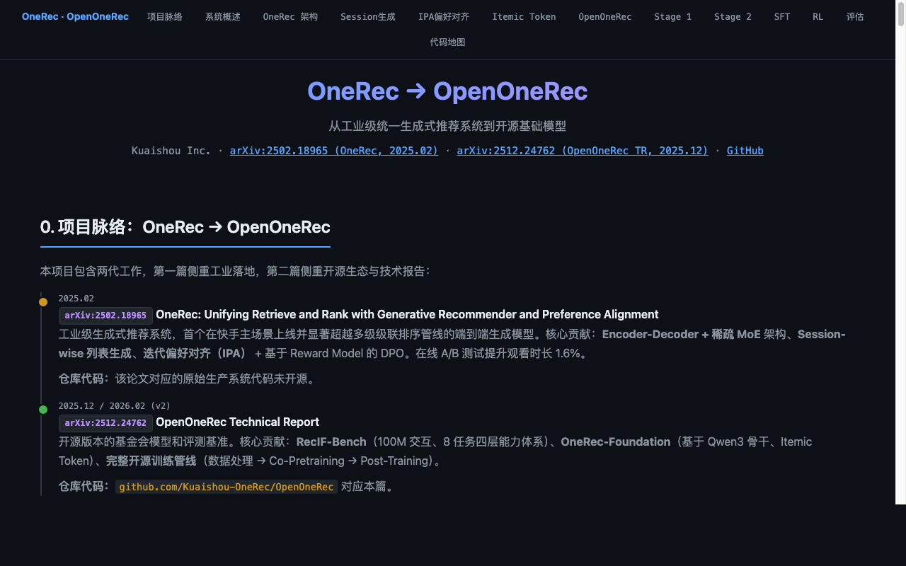

# Songming-skills

一个适用于 Claude Code / Codex 的技能集合，用来存放个人积累的 AI Agent 技能。每个技能独立目录，包含 `SKILL.md` 入口及可选的 `references/`、`scripts/`、`assets/` 子目录。

A personal collection of Claude Code / Codex skills. Each skill lives in its own directory with a `SKILL.md` entry point and optional `references/`, `scripts/`, `assets/` subdirectories.

## 目录 · Table of contents

- [v0.1 更新摘要 · v0.1 Release highlights](#toc-highlights)
- [这个仓库是做什么的 · What this does](#toc-what)
- [技能列表 · Skills](#toc-skills)
- [安装 · Installation](#toc-installation)
- [用法 · Usage](#toc-usage)
- [效果展示 · Gallery](#toc-gallery)
- [文档结构 · Documentation map](#toc-docs)
- [依赖要求 · Requirements](#toc-requirements)

<a id="toc-highlights"></a>
## v0.1 更新摘要 · v0.1 Release Highlights

- **初始版本**：首个技能 `model-training-explainer` 就位，支持给定仓库 + 论文生成单文件暗色主题 HTML。
  **Initial release**: first skill `model-training-explainer` is ready — generate a single-file dark-theme HTML from a code repository and a paper.

<a id="toc-what"></a>
## 这个仓库是做什么的 · What this does

本人日常工作中积累的 AI Agent 技能集合。每个技能封装一类特定任务的工作流，让 Claude Code / Codex 在收到相关指令时以一致且可预期的方式执行。技能独立于任何具体代码库，可在多个项目中复用。

This repo collects AI agent skills built through daily work. Each skill encapsulates a specific task workflow so Claude Code / Codex executes consistently and predictably when triggered. Skills are decoupled from any project and reusable across repos.

<a id="toc-skills"></a>
## 技能列表 · Skills

### model-training-explainer

**领域 Domain:** code-to-doc · paper-to-HTML · 模型架构解读 · 训练流程可视化

给定一个代码仓库和一篇论文（arXiv URL 或 PDF），生成单文件暗色主题 HTML，讲解模型及其训练流程：架构总览、数据流水线、训练策略、损失函数、评估，将论文中的每项 claim 映射到具体代码行，并用代表性数据集展示真实张量形状。

Given a code repository and a paper (arXiv URL or PDF), produce a single-file dark-theme HTML that walks through the model and its training pipeline — architecture overview, data pipeline, training strategy, loss functions, evaluation. Each paper claim maps to concrete code line references with real tensor dimensions.

| 文件 File | 作用 Purpose |
|---|---|
| `model-training-explainer/SKILL.md` | 技能定义与执行策略 / Skill definition and workflow |
| `model-training-explainer/references/template.css` | 暗色主题样式（架构图、流程图、代码块、表格、响应式） / Dark-theme CSS (arch diagrams, flow charts, code blocks, tables, responsive layout) |
| `model-training-explainer/references/template.js` | IntersectionObserver 滚动导航高亮 / Scroll-spy nav highlighter |

<a id="toc-installation"></a>
## 安装 · Installation

**Claude Code**

```bash
git clone https://github.com/<your>/Songming-skills.git ~/.claude/skills/Songming-skills
```

**Codex**

```bash
git clone https://github.com/<your>/Songming-skills.git ~/.codex/skills/Songming-skills
```

或 symlink 到项目的 `skills/` 目录：

Or symlink into a project's `skills/` directory:

```bash
ln -s /path/to/Songming-skills/model-training-explainer /path/to/your-project/skills/
```

<a id="toc-usage"></a>
## 用法 · Usage

安装后在对话中调用：

Invoke in conversation after installation:

```text
/model-training-explainer

> "结合代码库 https://github.com/xxx/xxx 和论文 https://arxiv.org/abs/xxx 生成解释的 HTML"
```

技能会先读取仓库结构和论文内容，提取关键信息，再生成单文件暗色主题 HTML。

The skill will read the repo structure and paper, extract key information, then produce a single-file dark-theme HTML.

<a id="toc-gallery"></a>
## 效果展示 · Gallery

### model-training-explainer 生成样例 · Generated sample

<p>
  <a title="OpenOneRec Explainer" href="https://github.com/<your>/Songming-skills/blob/main/docs/gallery/openonerec-hero.png"></a>
</p>

> 更多截图可复制到 `docs/gallery/` 中，然后在此处引用。 / Copy additional screenshots into `docs/gallery/` and reference them here.

<a id="toc-docs"></a>
## 文档结构 · Documentation map

| 文件 File | 作用 Purpose |
|---|---|
| `README.md` | 仓库介绍 / Repo introduction |
| `<skill-name>/SKILL.md` | 技能定义与执行策略 / Skill definition and workflow |
| `<skill-name>/references/` | 技能配套模板与参考 / Templates and references |
| `<skill-name>/scripts/` | 技能辅助脚本 / Helper scripts |
| `<skill-name>/assets/` | 静态资源 / Static assets |
| `docs/` | 效果截图等辅助文档 / Gallery screenshots and supporting docs |

<a id="toc-requirements"></a>
## 依赖要求 · Requirements

- Claude Code 或 OpenAI Codex，支持从本地目录加载 skill
- 各技能可能有额外依赖，见对应 `SKILL.md`

- Claude Code or OpenAI Codex, with skill loading from local directories
- Individual skills may have additional dependencies — see their `SKILL.md`
